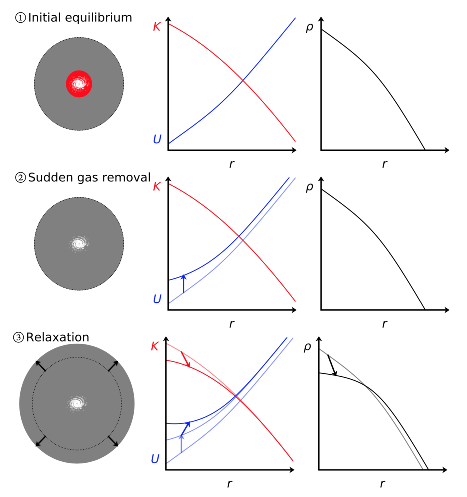

<h2> CuspCore: a model for core formation in dark matter haloes and ultra-diffuse galaxies by outflow episodes </h2>

This python program implements the model presented in <a href="https://ui.adsabs.harvard.edu/abs/2020MNRAS.491.4523F/abstract"  style="text-decoration:none" class="type1">Freundlich et al. (2020a)</a> for the response of a dissipationless spherical system to an instantaneous mass change at its centre. This model is meant to describe the formation of flat cores in dark matter haloes and ultra-diffuse galaxies from feedback-driven outflow episodes. The halo response is divided into an instantaneous change of potential at contant velocities followed by an energy-conserving relaxation. 

The different steps assumed by the model are illustrated below: (1) the initial dark matter halo is at equilibrium with its baryonic components (stars and gas), its kinetic energy K set by the Jeans equation; (2) after a sudden gas mass loss, the gravitational potential energy U adjusts instantly while the velocities and the kinetic energy remain frozen to their velocities, bring the halo to an out-of-equilibrium transitional state; and (3) the halo relaxes to a new equilibrium at constant dark matter shell energy, leading to the expansion of the dark matter distribution.  

